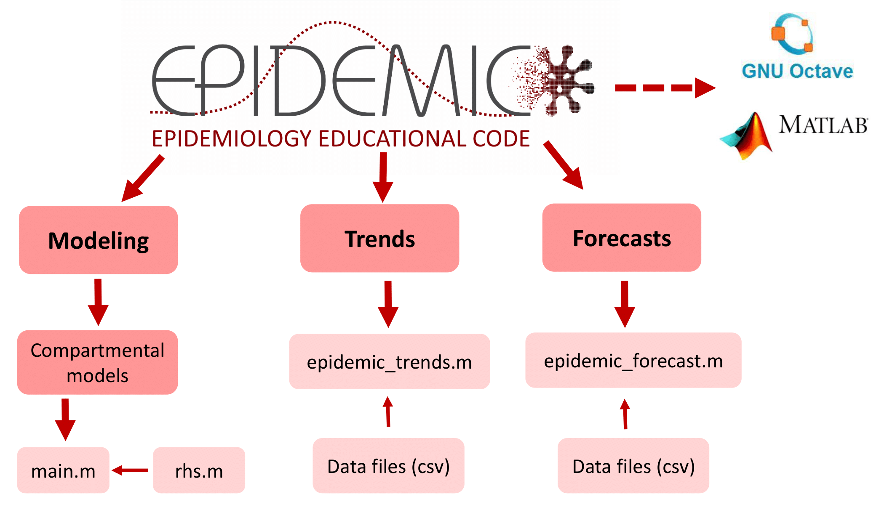

**EPIDEMIC - Epidemiology Educational Code** is an easy-to-run educational Matlab toolkit for epidemiological analysis, which offers functionalities for modeling an epidemic, monitoring its progress and forecasting the underling numbers of interest. This code is, first of all, an educational tool for researchers and students who are interested in computational epidemiology. The programs and tutorials are designed to offer good introductory material for beginners in the field. But they can also be used to analyze epidemic data, as well as in the construction of some simplistic epidemic models. The package is structured in 3 independent modules:
- **Modeling:** which uses differential equation-based compartmental models to emulate the dynamic behavior of homogeneous populations during an epidemic scenario;
- **Trends:** which uses several types of trend graphs to analyze the dynamic behavior of an epidemic as well as its underlyng rate of progress;
- **Forecasts:** which uses data-driven statistical regressors to make short-term predictions about certain quantities of interest underlying the epidemic.

The current stable version of **EPIDEMIC** is available on GitHub:

https://github.com/americocunhajr/EPIDEMIC

In the figure below, it is possible to observe the EPIDEMIC organization structure.



This EPIDEMIC package includes the following files:

**MODELING:**

- main_SIR.m
- rhs_SIR.m 
- main_SEIR.m
- rhs_SEIR.m 
- main_SEIRD.m
- rhs_SEIRD.m 
- main_SIRG.m
- rhs_SIRG.m
- main_SEIAHRD.m
- rhs_SEIAHRD.m 

**TRENDS:**
- epidemic_trends.m

**FORECASTS:**
- epidemic_forecast.m

## Tutorial

A tutorial style user guide for **EPIDEMIC** is available in English and Portuguese:

[EPIDEMIC_Tutorial_EN.pdf](https://github.com/americocunhajr/EPIDEMIC/blob/master/Docs/EPIDEMIC_Tutorial_EN.pdf)

[EPIDEMIC_Tutorial_PT.pdf](https://github.com/americocunhajr/EPIDEMIC/blob/master/Docs/EPIDEMIC_Tutorial_PT.pdf)


## Installation and use

To run the EPIDEMIC code, follow these steps:

1) Access the EPIDEMIC repository, available at [www.github.com/americocunhajr/EPIDEMIC](https://github.com/americocunhajr/EPIDEMIC) and download the folder with the code;
      
2) The working directory of the compatible software (Octave or MATLAB) is placed in the place where the folder with the EPIDEMIC codes is located and it is executed via the terminal;

3) If it is in the module Modeling, the executable file that generates the simulations is the files main. In the files rhs is possible to modify the differential equations, if that is the interest. In the module Trends, the executable file is epidemic_trends.m. And in the module Forecasts the executable file is epidemic_forecasts.m. In the tutorials you can get more information on how to use the codes.


## Octave/Matlab compatibility

**EPIDEMIC** was developed to be 100% compatible with the Octave and Matlab platforms. EPIDEMIC codes have been tested on at least GNU Octave 5.2.0 and MATLAB R2016b versions.

## Team:

**Faculty/Researchers:**
- Americo Cunha
- Bruna Pavlack
- Lisandro Lovisolo
- Malú Grave
- Rodrigo Burgos

**Students:**
- Diego Matos
- Eber Dantas
- João Pedro Norenberg
- Julio Basilio
- Leonardo de la Roca
- Lucas Chaves
- Marcos Vinicius Issa
- Michel Tosin
- Roberto Luo

**Design:**
- Amanda Cunha Guyt
- Luthiana Soares


## Citing EPIDEMIC

We ask users to cite the following manual in any publications reporting work done with **EPIDEMIC**:
- B. Pavlack et al. EPIDEMIC - Epidemiology Educational Code, 2022 www.EpidemicCode.org

```
@misc{EPIDEMIC2022,
   author       = {B. {Pavlack et al.}},
   title        = { {EPIDEMIC} - {E}pidemiology {E}ducational {C}ode},
   year         = {2022},
   publisher    = {GitHub},
   journal      = {GitHub repository},
   howpublished = {\url{www.EpidemicCode.org}},
}
```

## License

**EPIDEMIC** is released under the MIT license. See the LICENSE file for details. All new contributions must be made under the MIT license.

## Funding

 &nbsp; &nbsp;  &nbsp; &nbsp; 

## Institutional support

 &nbsp; &nbsp;  &nbsp; &nbsp;  &nbsp; &nbsp;  &nbsp; &nbsp; 

## Contribution to code and contact

Any EPIDEMIC user can contribute the code or seek support via email americo.cunha@uerj.br or open an [issue](https://github.com/americocunhajr/EPIDEMIC/issues). You can correct spelling or grammatical errors, suggest improvements and file bugs. If you find a bug, file the issue illustrating the bug with a minimal reproducible example. Experience reports on the use of EPIDEMIC are also welcome. If you want to suggest the insertion of a compartmental model in the Modeling module, it is necessary to send a preview of the code structure following the code pattern of the other compartmental models.
